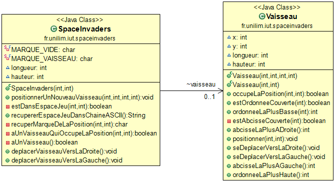
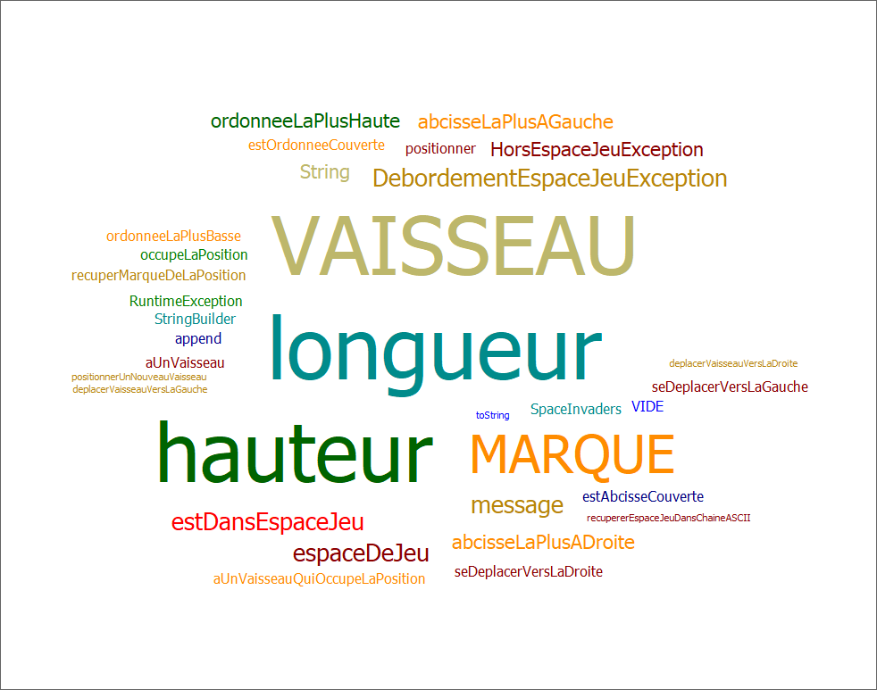
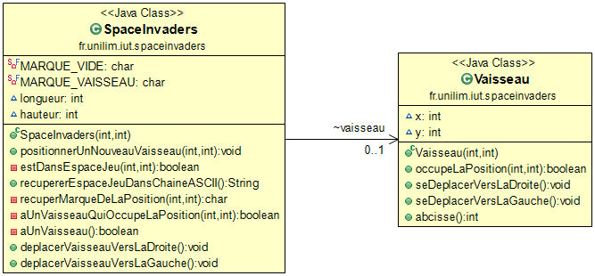

# SpaceInvaders

- [Semaine n°3 : du 10 au 15 mai](#semaine3)
- [Semaine n°2 : du 26 avril au 2 mai](#semaine2)
- [Semaine n°1 : du 19 au 25 avril](#semaine1)
- [Glossaire](#glossaire)

----
## Semaine n°3 : du 10 au 15 mai 

### Sprints et fonctionnalités réalisés

#### Fonctionnalité n°2 : Dimensensionner le vaisseau

- Etape 1 : Positionner un nouveau vaisseau avec une dimension donnée
Un nouveau vaisseau est créé avec une certaine hauteur et largeur.
Le vaisseau est positionné aux coordonnées transmises, et sa dimension est prise en compte pour le visuel.

- Etape 2 : Faire en sorte qu'il soit impossible de positionner un nouveau vaisseau qui déborde de l'espace de jeu
Le jeu vérifie que le vaisseau déborde ou non de l'espace de jeu avant de le positionner, et s'il déborde, le jeu ne créé pas le vaisseau.

### Diagramme de classe

### Nuage de mots

### Difficultés rencontrés

Aucune

### Remarques diverses

Aucune

----

## Semaine n°2 : du 26 avril au 2 mai 

### Sprints et fonctionnalités réalisés

#### Fonctionnalité n°1 : Déplacer un vaisseau dans l'espace de jeu

- Story 2 : Positionner un nouveau vaisseau dans l'espace de jeu
Un nouveau vaisseau est créé
Le vaisseau est positionné aux coordonnées transmises

- Story 3 : Déplacer le vaisseau vers la droite dans l'espace de jeu
Le vaisseau se déplace d'un pas vers la droite
Si le vaisseau se trouve sur la bordure droite de l'espace de jeu, le vaisseau doit rester immobile (aucun déplacement, aucune exception levée : le vaisseau reste juste à sa position actuelle).

- Story 4 : Déplacer le vaisseau vers la gauche dans l'espace de jeu
Le vaisseau se déplace d'un pas vers la gauche
Si le vaisseau se trouve sur la bordure gauche de l'espace de jeu, le vaisseau doit rester immobile (aucun déplacement, aucune exception levée : le vaisseau reste juste à sa position actuelle).

### Diagramme de classe

### Nuage de mots

### Difficultés rencontrés

Aucune

### Remarques diverses

Aucune

----

## Semaine n°1 : du 19 au 25 avril 

### Fonctionnalité en cours d'implémentation

**Fonctionnalité n°1 : Déplacer un vaisseau dans l'espace de Jeu**

- Story 1 : Créer un espace de jeu

----

## Glossaire 

- **Vaisseau** : véhicule commandé par le joueur, pouvant se déplacer de droite à gauche et ayant la possibilité de lancer des missiles destinés à détruire le(s) envahisseurs.
