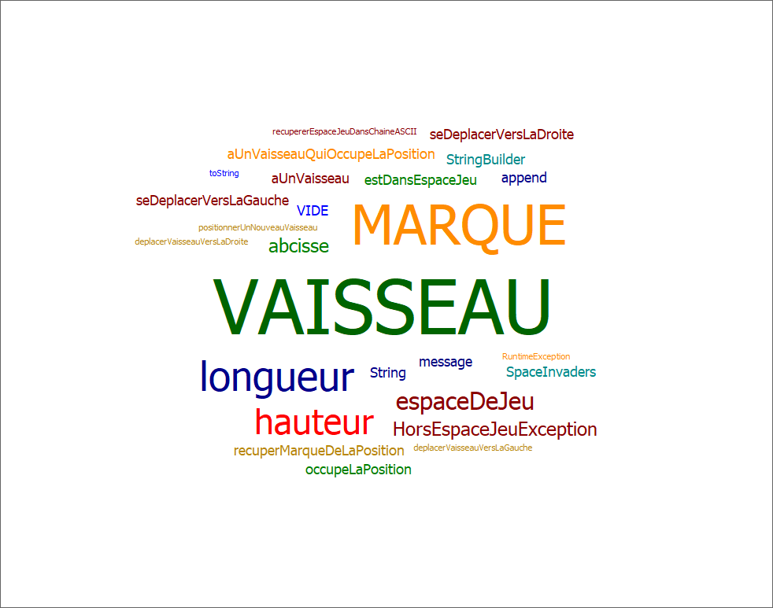

# SpaceInvaders

- [Semaine n°4 : du 17 au 21 mai](#semaine4)
- [Semaine n°3 : du 10 au 15 mai](#semaine3)
- [Semaine n°2 : du 26 avril au 2 mai](#semaine2)
- [Semaine n°1 : du 19 au 25 avril](#semaine1)
- [Glossaire](#glossaire)

----

## Semaine n°4 : du 17 au 21 mai 

### Sprints et fonctionnalités réalisés

#### Fonctionnalité n°2 : Dimensensionner le vaisseau

- Etape 3 : Déplacer un vaisseau vers la droite en tenant compte de sa dimension  
Avant de déplacer le vaisseau, on vérifie qu'il ne dépassera pas de l'espace de jeu  

- Etape 4 : Déplacer un vaisseau vers la gauche en tenant compte de sa dimension  
Même fonctionnement que l'étape 3, on vérifie que le vaisseau ne dépassera pas  

#### Fonctionnalité n°3 : Choisir la vitesse du vaisseau

- Etape 1 : Régler la vitesse du vaisseau  
On donne une vitesse qu vaisseau, qui représente le nombre de "cases" que le vaisseau va parcourir en un déplacement  

- Etape 2 : Faire en sorte que le déplacement se fasse *correctement* pour une vitesse quelconque  
On vérifie que le vaisseau se déplace du même nombre de cases que la vitesse donné  
On vérifie également que le vaisseau reste au bord de l'espace de jeu et ne dépasse pas  

### Diagramme de classe

### Nuage de mots

### Difficultés rencontrés

Aucune

### Remarques diverses

Aucune

----

## Semaine n°3 : du 10 au 15 mai 

### Sprints et fonctionnalités réalisés

#### Fonctionnalité n°2 : Dimensensionner le vaisseau

- Etape 1 : Positionner un nouveau vaisseau avec une dimension donnée  
Un nouveau vaisseau est créé avec une certaine hauteur et largeur.  
Le vaisseau est positionné aux coordonnées transmises, et sa dimension est prise en compte pour le visuel.  

- Etape 2 : Faire en sorte qu'il soit impossible de positionner un nouveau vaisseau qui déborde de l'espace de jeu  
Le jeu vérifie que le vaisseau déborde ou non de l'espace de jeu avant de le positionner, et s'il déborde, le jeu ne créé pas le vaisseau.  

### Diagramme de classe

### Nuage de mots

### Difficultés rencontrés

Aucune

### Remarques diverses

Aucune

----

## Semaine n°2 : du 26 avril au 2 mai 

### Sprints et fonctionnalités réalisés

#### Fonctionnalité n°1 : Déplacer un vaisseau dans l'espace de jeu

- Story 2 : Positionner un nouveau vaisseau dans l'espace de jeu  
Un nouveau vaisseau est créé  
Le vaisseau est positionné aux coordonnées transmises  

- Story 3 : Déplacer le vaisseau vers la droite dans l'espace de jeu  
Le vaisseau se déplace d'un pas vers la droite  
Si le vaisseau se trouve sur la bordure droite de l'espace de jeu, le vaisseau doit rester immobile (aucun déplacement, aucune exception levée : le vaisseau reste juste à sa position actuelle).  

- Story 4 : Déplacer le vaisseau vers la gauche dans l'espace de jeu  
Le vaisseau se déplace d'un pas vers la gauche  
Si le vaisseau se trouve sur la bordure gauche de l'espace de jeu, le vaisseau doit rester immobile (aucun déplacement, aucune exception levée : le vaisseau reste juste à sa position actuelle).  

### Diagramme de classe

### Nuage de mots

### Difficultés rencontrés

Aucune

### Remarques diverses

Aucune

----

## Semaine n°1 : du 19 au 25 avril 

### Fonctionnalité en cours d'implémentation

**Fonctionnalité n°1 : Déplacer un vaisseau dans l'espace de Jeu**

- Story 1 : Créer un espace de jeu

----

## Glossaire 

- **Vaisseau** : véhicule commandé par le joueur, pouvant se déplacer de droite à gauche et ayant la possibilité de lancer des missiles destinés à détruire le(s) envahisseurs.
- **Missile** : projectile envoyé à la verticale par le vaisseau vers l'envahisseur dans le but de le détruire.
- **Personnage** : Etre fictif et virtuel, contrôlé ou non par le joueur, qui apparaît dans un jeu vidéo.